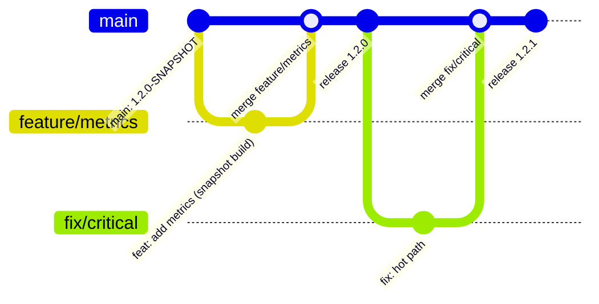

# Branching Model

This repo uses a lean trunk-based model with short-lived branches.

## Quick Summary
- `main` (or `master`) is always release-ready.
- Work happens in short-lived branches (`feature/*`, `fix/*`, `chore/*`).
- Snapshots are development states with `-SNAPSHOT` in Gradle `version`.
- Releases only happen from `main` via semantic-release.

## Branch Types
**`main`**
- Stable mainline branch.
- Every merge should be in a releasable state.

**`feature/*`**
- New features.
- Merged into `main` and then deleted.

**`fix/*` or `hotfix/*`**
- Bug fixes.
- Can branch off `main` and merge back directly.

**`chore/*` or `docs/*` (optional)**
- Maintenance or documentation changes.

## Snapshots and Releases
**Snapshots**
- Development versions end with `-SNAPSHOT`, for example `1.2.0-SNAPSHOT`.
- Feature/fix branches can build at any time without cutting a release.
- The default in `build.gradle.kts` should usually be a `-SNAPSHOT` version.
- semantic-release does not create snapshots; snapshots are manual dev versions.

**Releases**
- semantic-release runs only on `main` and overwrites `build.gradle.kts` with the release version.
- Example: `1.2.0-SNAPSHOT` becomes `1.2.0`, plus a changelog update.
- After a release, the version can be bumped back to the next `-SNAPSHOT` (manual or via future automation).

## How semantic-release decides versions
semantic-release uses Conventional Commits in the merge history on `main`:
- **Major** release when a commit includes `BREAKING CHANGE:` in the footer/body or uses `type!`, e.g. `feat!: remove legacy api`.
- **Minor** release for `feat:` commits.
- **Patch** release for `fix:` commits.
- **No release** for commits that do not match release rules (for example `docs:`).

## Pre-releases (alpha, beta, rc)
semantic-release can publish pre-releases from dedicated branches. The common setup:
- Create branches like `alpha`, `beta`, and `rc`.
- Mark them as prerelease branches in `.releaserc.json`.
- Each branch produces versions like `1.3.0-alpha.1`, `1.3.0-beta.2`, `1.3.0-rc.1`.
- When changes are ready, merge into `main` for the stable release (without the prerelease tag).

Example branch config (in `.releaserc.json`):
```json
{
  "branches": [
    "main",
    { "name": "alpha", "prerelease": "alpha" },
    { "name": "beta", "prerelease": "beta" },
    { "name": "rc", "prerelease": "rc" }
  ]
}
```

## Example Flow

